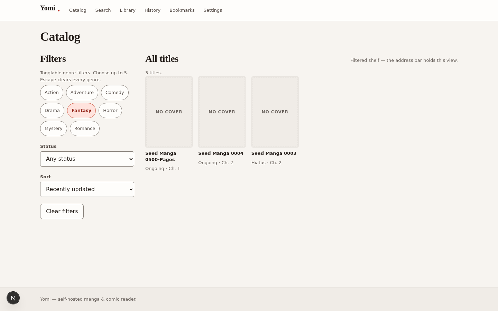
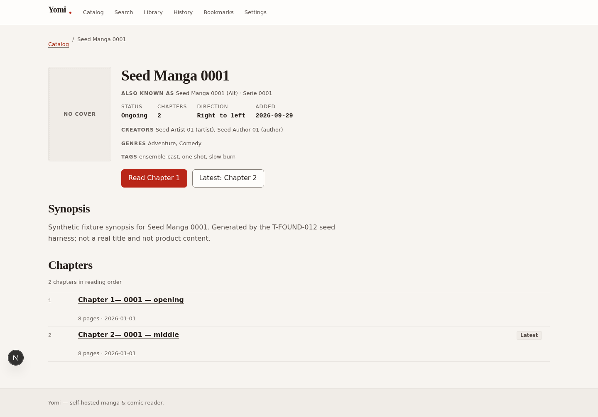
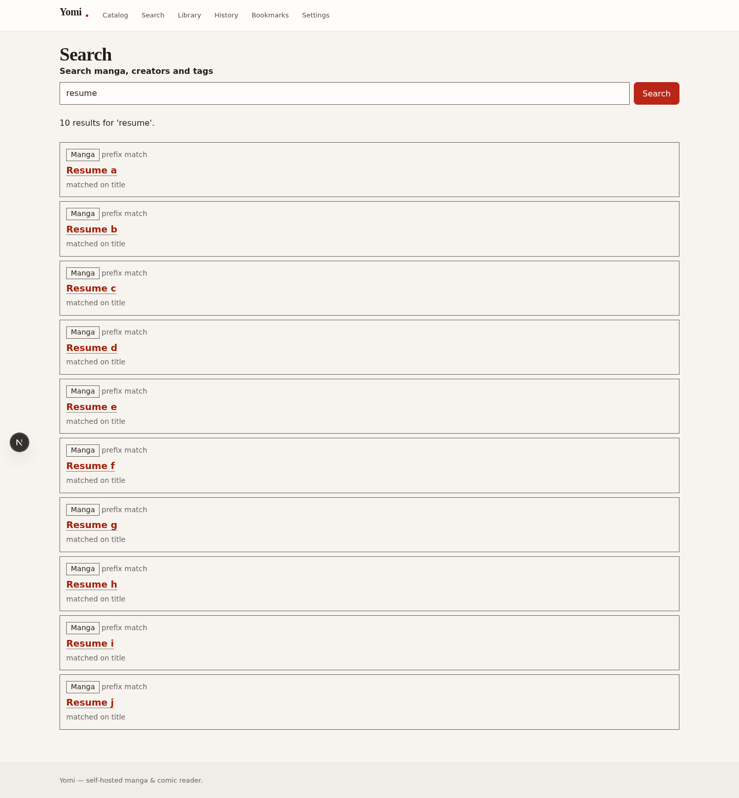
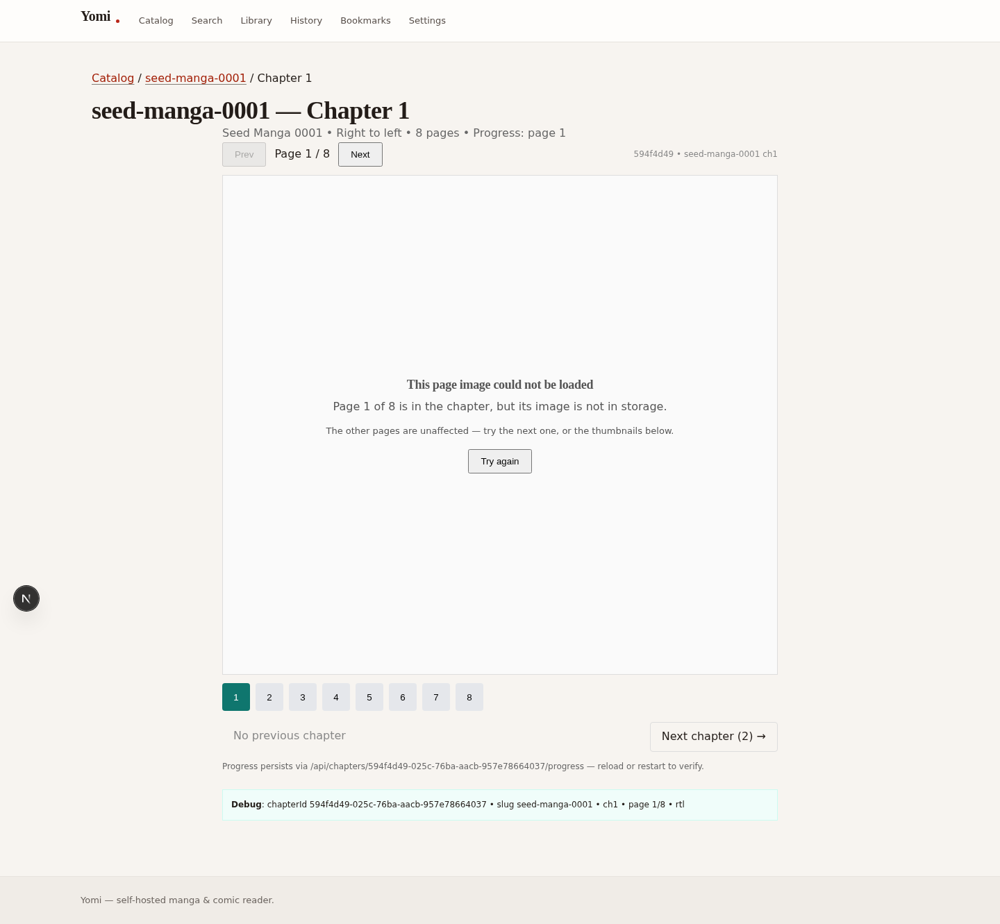
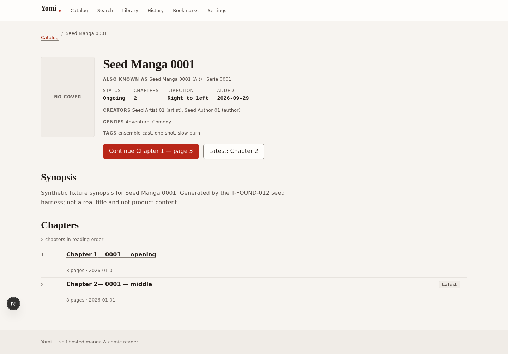

# Yomi — user guide

> **The one question this answers:** I have Yomi running — what can I
> actually do with it, and how do I get my own manga into it? **Short
> answer:** browse a catalog, search it, read chapters, and keep a shelf
> that remembers where you stopped. Content arrives through a seed script
> today; the upload flow is designed, specified below, and not yet
> reachable.

## What Yomi is

Yomi is a self-hosted manga and comic reader: your files, your database,
your server, no account on someone else's cloud. The reading loop is one
line — **find a title, open a chapter, turn pages, come back later and keep
going from the same page.** Everything in this guide serves that loop.

## Run it

**Current.** Three commands, in order. The app refuses to boot without its
environment (by design — a half-configured reader would fail at read time
instead), so set the variables first; the names that matter are
`DATABASE_URL`, `APP_ORIGIN`, `SESSION_SECRET`, the `S3_*` group, and
`STORAGE_DIR`. Full definitions live in `DEPLOYMENT.md` — this guide links
them rather than copying them.

```bash
docker compose -f docker/docker-compose.dev.yml up -d   # Postgres + S3-compatible storage
npm run db:migrate                                        # schema first, always
npm run seed -- --env dev --manga 10 --load-titles 200   # catalog content
npm run dev                                               # the app
```

The seed writes twelve real titles with chapters and pages, plus two
accounts (`seed-admin@seed.invalid`, `seed-reader@seed.invalid`, passwords
from `SEED_ADMIN_PASSWORD` / `SEED_READER_PASSWORD`).

**One trap that cost a morning:** open the app at `http://localhost:PORT`,
never `http://127.0.0.1:PORT`. The dev server refuses its own live-reload
handshake for the IP host, and a client that never completes that handshake
never becomes interactive — every page renders, no button works, and nothing
tells you why. Observed and verified; see `docs/journeys/JOURNEYS.md`.

## Your first session

**Current.** No account needed. The home page is honest about being a
placeholder and points at the one open door:

1. **Browse the catalog** (`/discover`) — 22 titles with statuses and
   chapter counts, genre chips (up to 5, `Escape` clears), a status filter,
   and sort. Every title is a link.
   
2. **Filter by genre** — the chip latches pressed and the list narrows.
   
3. **Open a title** — aliases, status, direction, creators, genres, tags,
   synopsis, “Read Chapter 1” / “Latest”, and the chapter table.
   
4. **Search** (`/search`) — anonymous and reachable. The query lives in the
   URL, so a search is a link you can share; results are labelled with kind,
   ranking band, and which field matched.
   
5. **Read** — counter, prev/next, thumbnails, next-chapter link, and progress
   that persists across reloads.
   
6. **Deep-link a page** — `/manga/{slug}/chapter/{n}?page={p}` opens exactly
   there and wins over saved progress; out-of-range values clamp to the ends
   instead of blanking.

The full walk, step by step with a screenshot for each, is
`docs/journeys/JOURNEYS.md` (journeys J1–J4).

## Your shelf

**Current.** Sign in (`POST /api/auth/login` today; the sign-in form is
**Planned** as F-004) and three pages come alive:

- **Library** — titles you kept, with unread counts, last position, and
  dates.
- **History** — what you read, and how far.
- **Bookmarks** — saved titles.
- **Resume** — the title page button becomes “Continue Chapter 1 — page 3”,
  resolved from your session. This is the payoff of the whole track:
  

Marking a chapter unread is real too (`POST
/api/library/chapters/{id}/read-status`), and progress merging is
last-writer-wins with a sticky “completed” that a later page-turn cannot
erase.

## What is real, and what is not

| Surface                                             | Status                                                     |
| --------------------------------------------------- | ---------------------------------------------------------- |
| Catalog, filters, sort                              | **Current**                                                |
| Search (service + UI)                               | **Current**                                                |
| Reader, deep links, clamping, auto-next             | **Current**                                                |
| Library, history, bookmarks, resume, mark-unread    | **Current** (needs a session)                              |
| Preferences storage + auto-next consumption         | **Current** (API only)                                     |
| Home page, sign-in form, settings page, admin pages | **Planned** — placeholders that say so and name their task |
| Image rendering                                     | **Current, broken** — see Known issues                     |
| Manga upload                                        | **Planned** — service exists, nothing reachable; see below |

## Getting manga in

### Today: the seed (**Current**)

The only ingest path that exists end to end is the seed harness:

```bash
npm run seed -- --env dev --manga 10 --load-titles 200
```

It writes titles, chapters, page rows, vocabulary, and the two accounts in
one insert-only pass and verifies the read-back. It is a fixture loader, not
an uploader: re-running writes nothing new, and it cannot take _your_ files.

### The upload flow, as designed (**Planned**)

What follows is the specified behavior of the ingest service that already
exists in `src/features/uploads/upload-pipeline.ts`. It is **not reachable**
— no route calls it, no page drives it — and this section is written for
whoever builds the last mile, so the design is on record before the UI
exists.

**Contract.** One call ingests one chapter's pages:

- Input: a chapter id, page images **in order** (`{ bytes, sourceFormat }`
  per page), and whether to publish on commit.
- Limit: `INGEST_MAX_PAGES = 200` pages per call (the reference wall-clock
  budget in `PERFORMANCE.md` §9).
- Caller must be an admin; anyone else gets `AUTH_FORBIDDEN` before any work.

**Mechanism.** Validate everything before storing anything: all pages are
normalized (AVIF/WebP/JPEG variants) before the first object lands in
storage, rows commit through the chapter repository, and any store or commit
failure purges what was written — a chapter is never left half-ingested. One
audit event records the ingest. Publishing is a transition the admin
repository performs, not a flag the caller sets.

**Boundaries.** The pipeline owns ingest and its own cleanup; it does not own
authentication (the caller arrives already resolved), image decoding (the
`ImageProcessorPort`, still a stub at `T-UPLOAD-004`), or resumability (the
old multi-part `upload_job` driver was deliberately replaced by this
synchronous call — F-017).

**What must land first, in order:**

1. **F-005 route guards** — no admin surface may exist on any route before
   page-level protection does. This is a security ordering, not a preference.
2. **Upload routes** — `prepare` (`T-UPLOAD-008`), `status` (`T-UPLOAD-009`),
   and `finalize` (`T-UPLOAD-010`) currently throw by design; they become the
   HTTP skin over the pipeline.
3. **The admin form** (`T-UPLOAD-010`, `T-UPLOAD-013`) — file picker,
   progress, and the publish choice that maps to `IngestInput.publish`.
4. **The image processor** (`T-UPLOAD-004`) — without it there is nothing to
   normalize, and ingest stays a service with no hands.

## When something is missing

**Current.** Yomi never crashes into a blank page. Every unbuilt surface
renders the same honest placeholder: what the route is for, the task that
owns it (e.g. `T-READER-018` for settings), and a way back to reading. A
missing page (`/does-not-exist`) gets a real 404 with the same treatment.
Screenshots: journeys J6 in `docs/journeys/JOURNEYS.md`.

## Known issues

**Current, verified 2026-09-29.**

- **No image loads (P0).** The pages API hands the client extension-less
  `/media/{key}` URLs while the delivery route only accepts
  `/media/{key}.avif|webp|jpeg` — the extension is the variant selector,
  taken from the key, never negotiated. Every reader image is a 404 with a
  designed-for error state. The same grammar rejects the seed's cover keys,
  so every catalog cover reads “NO COVER”. Root cause is a spec
  contradiction between ADR-005 / `API_CONTRACT.md` §2.1 and
  `src/server/media/page-delivery.ts`; the fix belongs to whichever side the
  ledger rules against.
- **Dev browser host.** Use `localhost`, never `127.0.0.1` (see “Run it”).

## Code and operational map

- Journeys with screenshots: `docs/journeys/JOURNEYS.md`
- Decisions that shaped this behavior: `docs/adr/`
- API promises and error codes: `API_CONTRACT.md`
- Run and deploy: `DEPLOYMENT.md` · Incidents: `RUNBOOK.md`
- What the test suite proves: `TEST_STRATEGY.md` (788 passing at last gate)

Details owned by those documents are linked, not repeated, so this guide
stays true when they move.
